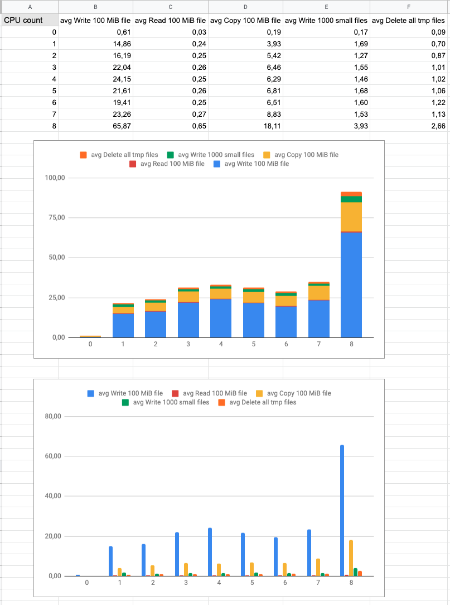

# docker-io-test
Simple IO performance test for docker. Relates to my [issue on GitHub](https://github.com/docker/for-mac/issues/3771).

## How to start it
For 3 repeated runs for current number of assigned cores run
```
$ ./test.sh 3
34,69	0,34	11,55	1,98	1,40
29,73	0,32	7,43	1,77	0,98
33,73	0,28	7,27	1,60	1,24
```

To test it natively run
```
$ INSIDE=true ./test.sh 3
0,64	0,02	0,13	0,21	0,09
0,69	0,02	0,11	0,17	0,12
0,73	0,01	0,11	0,16	0,09
```

You can also add `--verbose` to print test names
```
$ ./test.sh 3 --verbose

TEST - write 100 MiB file
100000+0 records in
100000+0 records out
real 27.33
user 0.43
sys 3.28

TEST - read 100 MiB file
real 0.31
user 0.00
sys 0.06

TEST - copy 100 MiB file
real 8.69
user 0.00
sys 1.22

TEST - write 1000 small files
real 2.25
user 0.04
sys 0.20

TEST - delete all tmp files
real 1.75
user 0.01
sys 0.16
```

## Results
Here are results for my machine (MacBook Pro 15-inch, 2017).

> `CPU count = 0` means native run in MacOS.

Raw data available at [my google sheet](https://docs.google.com/spreadsheets/d/11Kijkn0wK83d_zOvmTW9A77vbMC1fbG8LwLygLysqkU/edit?usp=sharing).


