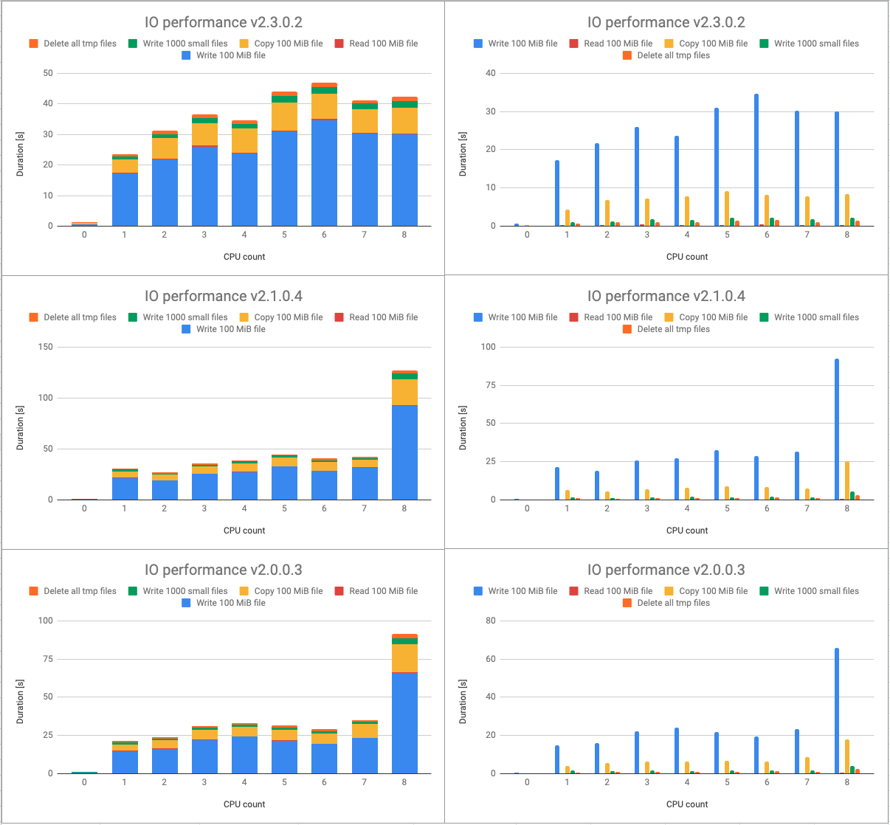

# docker-io-test
Simple IO performance test for docker. Relates to my [issue on GitHub](https://github.com/docker/for-mac/issues/3771).

## How to start it
Simply run
```
$ ./test.sh
```

## Results
Here are results for my machine (MacBook Pro 15-inch, 2017).

> `CPU count = 0` means native run in MacOS.

Raw data available at [my google sheet](https://docs.google.com/spreadsheets/d/11Kijkn0wK83d_zOvmTW9A77vbMC1fbG8LwLygLysqkU/edit?usp=sharing).
 
Docker Desktop version 2.0.0.3 (31259) / stable / 8858db33c8

